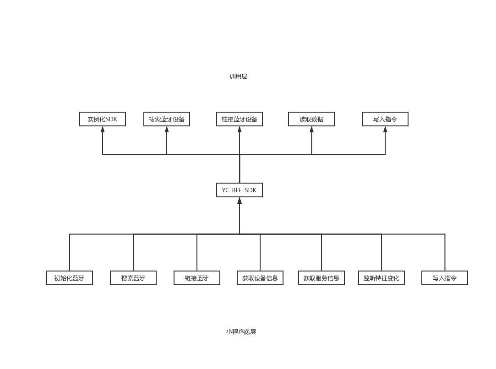

# 小程序接入蓝牙体温计SDK

## SDK介绍

通过小程序链接孕橙智能蓝牙体温计，可实现绑定蓝牙设备、实时测温、接受离线数据等，以及数据解析、数据可视化的功能。




## 引入代码插件包

在app.json中添加plugin

```javascript
 "plugins": {
    "lhPlugin": {
      "version": "1.0.0",
      "provider": "wx901bf269d5a0089d"
    }
  }
```


## SDK初始化

### new YC_BLE_SDK(option)

>  用于初始化一个SDK，返回初始化后的SDK实例。 

```javascript
import YC_BLE_SDK from 'YC_BLE_SDK'

// 实例化SDK
new YC_BLE_SDK()
```


## 参数

初始化SDK时传入

### option

- 类型：object

- 默认值：{}

- 用法：

  ```javascript
  new YC_BLE_SDK({
      interval: 1
  })
  ```

  实例化SDK需要的参数

  

### option.interval

- 类型：number|float

- 默认值：1

- 用法：

  ```javascript
  new YC_BLE_SDK({
      interval: 0.3 // 代表300毫秒检索一次
  })
  ```

  搜索附近蓝牙设备间隔时间，单位是秒


### option.timeout

- 类型：number|float

- 默认值：30

- 用法：

  ```javascript
  new YC_BLE_SDK({
      interval: 0.3, // 代表300毫秒检索一次
      timeout: 60 // 代表30秒未搜索到设备会停止检索
  })
  ```

  搜索附近设备超时时间，超过时间将不会继续检索，触发onError


### option.devices

- 类型：array

- 默认值：[]

- 用法：

  ```javascript
  new YC_BLE_SDK({
      interval: 0.3, // 代表300毫秒检索一次
      timeout: 60, // 代表30秒未搜索到设备会停止检索
      devices: [
          {
              deviceId: '0000FFE3-0000-1800-8000-00805F9B34FI',
              name: 'yuncheng_a33'
              ... // 设备信息
          }
      ]
  })
  ```

  传入蓝牙设备信息，检索到后会自动链接，一般为已绑定设备


### option.mode

- 类型：string

- 默认值：'search'

- 用法：

  ```javascript
  new YC_BLE_SDK({
      mode: 'conn' // 如果传入devices信息，会自动进行连接
  })
  ```

  初始化后自动执行的模式，search|conn，search 自动搜索设备模式，conn 自动链接设备模式（需要传入devices字段）


## 方法

实例化SDK时传入，通常用来监听蓝牙的一些事件，如：蓝牙链接变化、初始化成功、断开链接等等

### option.init

- 类型：function

- 默认值：null

- 用法：

  ```javascript
  new YC_BLE_SDK({
      init: (res) => {
          // 蓝牙模块初始化成功
      }
  })
  ```

  蓝牙初始化成功后触发回调，回调参数会连接信息


### option.onSearch

- 类型：function

- 默认值：() => {}

- 用法：

  ```javascript
  new YC_BLE_SDK({
      onSearch: (res) => {
          // 返回附近蓝牙设备，res.devices为设备信息，类型为array
      }
  })
  ```

  监听搜索到的蓝牙设备，默认每1秒返回一次，可听过interval修改间隔时间


### option.onConnect

- 类型：function

- 默认值：null

- 用法：

  ```javascript
  new YC_BLE_SDK({
      onConnect: (device) => {
          // 蓝牙设备连接成功，device为已连接的设备信息
      }
  })
  ```

  成功连接蓝牙设备后触发，返回参数为已连接的蓝牙信息，连接


### option.startNotifyBack

- 类型：function

- 默认值：null

- 用法：

  ```javascript
  new YC_BLE_SDK({
      offConnect: () => {
          // 开启监听设备数据上传
      }
  })
  ```

  启用监听设备数据上传，默认不会自动监听设备数据上传，节省性能


### option.onUpload

- 类型：function

- 默认值：null

- 用法：

  ```javascript
  new YC_BLE_SDK({
      offConnect: (res) => {
          // 收到设备上传的数据
          // res.type，数据类型，1.上传当次测温数据 11. 上传历史测温数据
          // res.result，数据结果
      }
  })
  ```

  监听设备数据上传，初次连接成功后，可以尝试获取设备离线数据sdk.getHistory

  

### option.onError

- 类型：function

- 默认值：null

- 用法：

  ```javascript
  new YC_BLE_SDK({
      onError: () => {
          // 蓝牙断开，异常，初始化失败等错误回调
          // 错误码：
          // 10000 未初始化蓝牙适配器
  		// 10001 当前蓝牙适配器不可用
  		// 10003	connection fail	连接失败
  		// 10004 没有找到指定服务
  		// 10005 没有找到指定特征值
  		// 10006 当前连接已断开
  		// 10007 当前特征值不支持此操作
  		// 10008 其余所有系统上报的异常
  		// 10009 系统特有，系统版本低于 4.3 不支持 BLE
  		// 10012 连接超时
  		// 10013 为空或者是格式不正
      }
  })
  ```

  发生错误触发


### option.onTimeout

- 类型：function

- 默认值：null

- 用法：

  ```javascript
  new YC_BLE_SDK({
      onTimeout: err => {
          // 设备链接超时触发，超时时长可通过timeout修改
      }
  })
  ```

  设备链接超时触发，超时时长可通过timeout修改

## 实例方法

通过SDK返回的实例去调用

### sdk.getHistory

- 类型：function

- 默认值：null

- 用法：

  ```javascript
  let sdk = new YC_BLE_SDK({
      init: (res) => {
          // 蓝牙模块初始化成功
      }
  })
  
  sdk.getHistory
  ```

  获取蓝牙设备的离线数据，如没有则返回空数组，调用成功后，数据会通过onUpload上传

### sdk.offlineData

- 类型：function

- 默认值：null

- 用法：

  ```javascript
  let sdk = new YC_BLE_SDK({
      interval: 0.3,
      timeout: 30,
      mode: 'conn',
      devices: devices, // 传入已知设备信息，会直接搜索并链接
      init: () => {
        this.setData({
          isOpen: true
        })
      },
      onConnect: device => {
        // 成功链接蓝牙
        sdk.offlineData() // 获取离线数据
      }
  })
  ```

  获取蓝牙设备的离线数据，如没有则返回空数组，调用成功后，数据会通过onUpload上传

### sdk.startNotice

- 类型：function

- 默认值：null

- 用法：

  ```javascript
  let sdk = new YC_BLE_SDK({
      init: (res) => {
          // 蓝牙模块初始化成功
      },
      onConnect: res => {
        sdk.startNotice()
      }
  })
  ```

  启用数据上传监听，默认为关闭状态


### sdk.restart

- 类型：function

- 默认值：null

- 用法：

  ```javascript
  let sdk = new YC_BLE_SDK({
      init: (res) => {
          // 蓝牙模块初始化成功
      },
      offConnect: res => {
        sdk.restart()
      }
  })
  ```

  蓝牙设备断开链接后，调用词方法尝试重新链接设备，也可在小程序事件中调用，如：bindtap

### sdk.closeBLEConnection

- 类型：function

- 默认值：null

- 用法：

  ```javascript
  Component({
    methods: {
      handle () {
        sdk.closeBLEConnection()
      }
    }
  })
  ```

  用户可以主动断开蓝牙链接

### sdk.closeBluetoothAdapter

- 类型：function

- 默认值：null

- 用法：

  ```javascript
  Component({
    methods: {
      onUnload () {
        sdk.closeBluetoothAdapter()
      }
    }
  })
  ```

  页面销毁之前尽量关闭蓝牙模块，降低消耗，清除内存